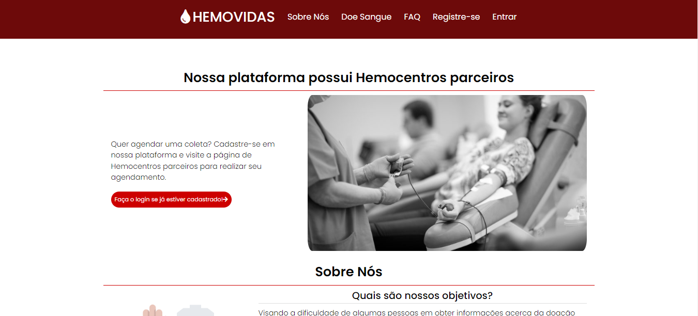
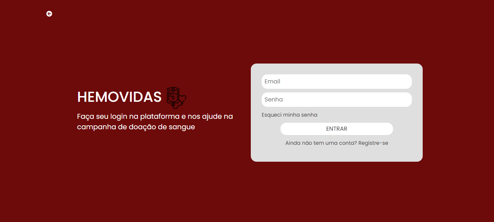

# Projeto de Interface

## User Flow

> **Protótipo**:
> - [User Flow - Completo como um protótipo](https://www.figma.com/proto/4ffq1mb2qRNtL5FlDXU6kJ/Prot%C3%B3tipo-Doa%C3%A7%C3%A3o-Sangue?node-id=64%3A342&scaling=min-zoom&page-id=64%3A341&starting-point-node-id=64%3A342)

## Wireframes

 

 

> Todas as wireframes usadas para produzir o protótipo.
> 
> **Wireframes/Ferramenta**:
> - [Ferramenta Utilizada: Figma](https://www.figma.com)
> - [Wireframes Completos no Figma](https://www.figma.com/file/4ffq1mb2qRNtL5FlDXU6kJ/Protótipo-Doação-Sangue?node-id=0%3A1)
