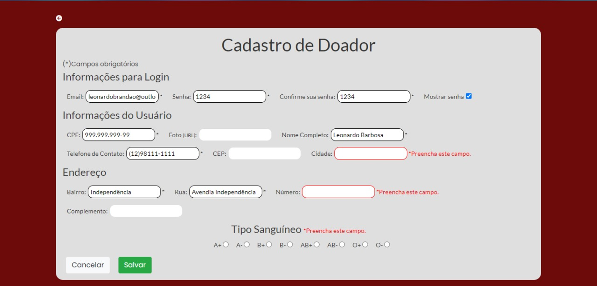
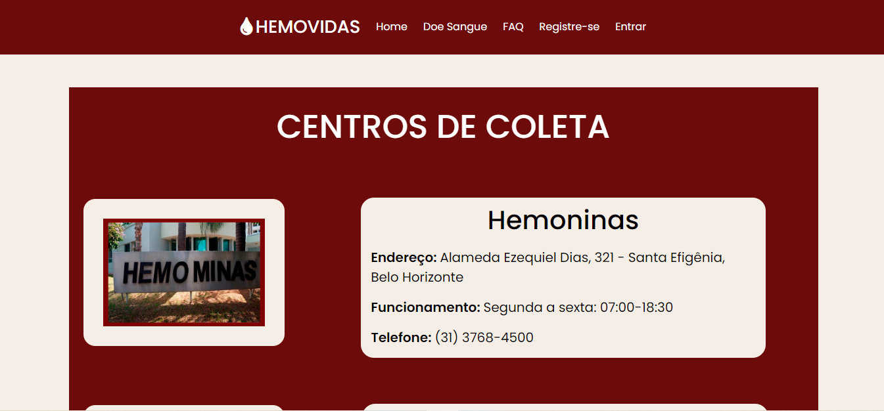
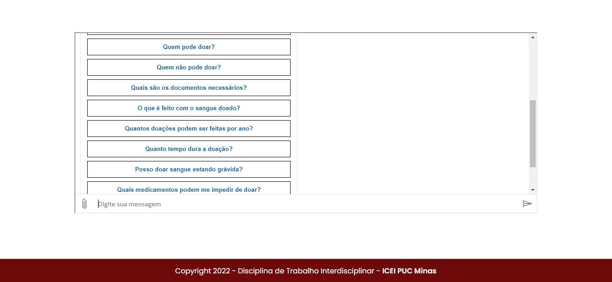

# Projeto da Solução

## Tecnologias Utilizadas

> Em começo o "Desenho" anterior para observação do possível Userflow de nosso projeto foi estabelicido em Adobe Illustrador, logo após toda sua montagem foi utilizada pelo figma, wireframes e protótipo.

## Arquitetura da solução

>Primeiro contato do usuário é frame "Central" onde ele pode optar caso for um doador, se inscrever , assim levando para o frame 2 "Login do Usuário", caso não há um cadastro é direcionado para o frame "Cadastro", após o login/cadastro é destinado para uma pagina de centros dísponíveis na cidade de Belo Horizonte- MG.

## Tela Home

### Tela de Login

### Tela de Cadastro

### Tela de Centro

### Tela de FAQ
