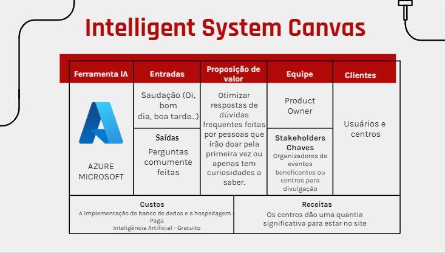

# Sistema inteligente

## O que é?

> O QnA Maker é um serviço de NLP (processamento de idioma natural) baseado em nuvem que permite criar uma camada de conversa natural sobre seus dados.
>
## Como foi implementado?
>O sistema escolhido para implementação de QnA apresentado foi o serviço Azure. Que por meio da assinatura de estudante, fornece a IA de forma gratuita e com certeza de funcionalidade porém online.
>
 

 
