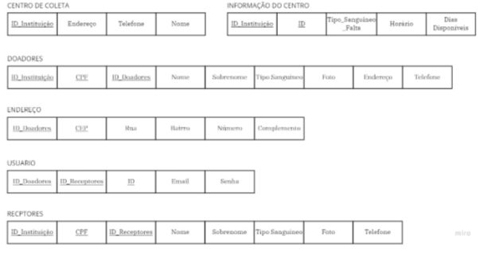
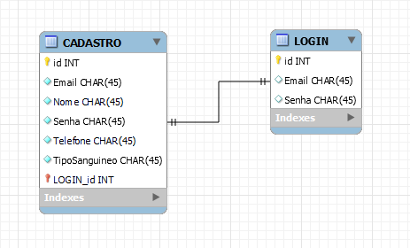

# Sistema inteligente

## O que é?

> O banco de dados não foi o maior foco nesse projeto uma vez que se trata de uma base informacional sobre os centros de coleta
>
## Modelo entidade relacionamento:
>Os usuários são cadastrados por meio do email e senha, em complemento ao telefone, nome e tipo sanguíneo. A conta é novamente acessada por meio do login que exige o e-mail e a senha previamente cadastrados.
>
 

## Modelos: 

 